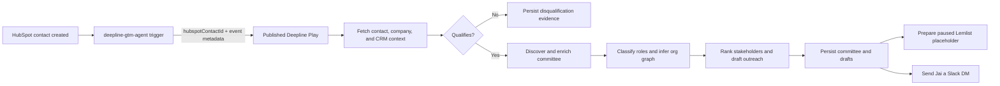

# Inbound Buying Committee Agent

## Goal

Add an inbound qualification and buying-committee workflow to `deepline-gtm-agent`.
The agent is a thin trigger and dispatcher. A published Deepline Play owns the
entire workflow after receiving a HubSpot contact identifier.

The first win is a newly created HubSpot contact from a company Deepline has not
yet processed. The workflow qualifies the company, builds a buying-committee
view, drafts outreach to relevant stakeholders, prepares a paused Lemlist
campaign, and sends Jai a decision-ready Slack direct message.

## Scope

### Included

- Accept a HubSpot contact-created event through `deepline-gtm-agent`.
- Deduplicate triggers using the HubSpot contact ID and event ID when present.
- Invoke one published Deepline Play and return its run ID and status.
- Fetch the HubSpot contact, associated company, and existing CRM relationships.
- Qualify the account using the existing Deepline criteria:
  - at least 50 employees;
  - B2B business model;
  - an identifiable GTM or RevOps function.
- Discover a 6–12 person enterprise buying committee across relevant functions.
- Enrich committee members and preserve evidence, provenance, and confidence.
- Infer an org chart while clearly labeling every reporting relationship as
  inferred rather than verified.
- Rank stakeholders by likely influence and select a primary outreach target who
  is not the signup contact.
- Draft and store outreach for each committee member.
- Prepare a paused Lemlist campaign placeholder without enrolling or sending to
  any lead.
- Send Jai a Slack DM containing the qualification result, committee summary,
  primary target, and pre-populated primary email draft.
- Persist run state, committee records, inferred edges, drafts, Slack delivery,
  and Lemlist placeholder state in Deepline Customer DB datasets.

### Deferred

- Automatically sending Lemlist messages or enrolling leads.
- Automatically writing committee data back to HubSpot.
- Website-visitor triggers. The play input contract will support adding this
  source later without changing the workflow internals.
- Verified reporting lines. Available sources support people and title evidence,
  but not authoritative manager relationships.
- A custom visual org-chart application. The MVP stores an exportable graph and
  renders a compact Slack committee view.

## Architecture



The agent boundary contains no qualification, enrichment, provider routing,
drafting, persistence, Slack composition, or Lemlist logic. It validates the
incoming trigger, supplies a stable idempotency key, calls the published play,
and exposes the resulting Deepline run identifier for observability.

The play uses only replay-safe Deepline runtime APIs such as `ctx.tools.execute`,
`ctx.dataset`, `ctx.runPlay`, `ctx.fetch`, `ctx.secrets`, and `ctx.step`. It does
not use local filesystem access, process environment reads, raw `fetch`, current
timestamps, or random values inside the play body.

## Trigger Contract

The agent receives a normalized event with this logical shape:

```ts
type InboundBuyingCommitteeTrigger = {
  source: "hubspot_contact_created";
  hubspotContactId: string;
  hubspotEventId?: string;
  occurredAt?: string;
};
```

The agent invokes the play with the same values plus an idempotency key:

```text
hubspot:<hubspotContactId>:<hubspotEventId-or-created>
```

The initial transport is an authenticated HubSpot contact-created workflow
webhook sent to the agent's inbound buying-committee endpoint. The endpoint
terminates at the agent dispatch method. The dispatch method must not perform
any workflow stage directly.

## Play Stages

### 1. Intake and idempotency

The play persists the trigger before provider work. A previously completed
idempotency key returns the prior result. A retryable failed run may resume from
durable stage state without duplicating Slack messages or Lemlist placeholders.

### 2. HubSpot context

The play fetches the contact by ID, its associated company, and existing CRM
contacts at that company. Existing contacts are retained as relationship
evidence and are not unnecessarily re-enriched. The company domain is the
canonical account key when present; otherwise the run stops with a structured
`missing_company_domain` result.

### 3. Qualification

Qualification has three independent evidence-backed gates:

1. `employee_count >= 50` using an exact numeric headcount field. A range alone
   is recorded as uncertain and does not become an invented exact value.
2. `business_model = B2B` based on explicit firmographic or research evidence.
3. At least one credible GTM or RevOps function signal, including relevant
   Sales, Revenue Operations, GTM Operations, Growth, or commercial operations
   roles.

Every gate produces `yes`, `no`, or `unknown`, confidence, rationale, sources,
and observed values. The account qualifies only when all three gates are `yes`.
Unknown evidence results in a stored manual-review outcome rather than an
automatic qualification.

### 4. Committee discovery

For qualified accounts, the play discovers companies first and people second.
It uses the company’s real title roster where available, qualifies exact titles,
then finds and enriches contacts. Search and enrichment provider contracts are
discovered and described before the play is finalized; stable tool IDs and
declared getters are used in the published source.

The target committee contains 6–12 distinct people and seeks coverage across:

- economic buyer: CRO, COO, CTO, or another executive owning the budget;
- business owner: VP/Head of RevOps, GTM Operations, Sales Operations, or Sales;
- technical evaluator: VP/Head/Director of Engineering, Data, GTM Engineering,
  or Revenue Systems;
- operators and champions: relevant directors or senior managers in RevOps,
  Sales, Growth, Marketing Operations, or Business Operations;
- likely blockers or risk stakeholders when evidence supports their relevance.

The signup contact remains in the map but cannot be the primary outbound target.
The play does not force every function into every account. It records missing
role coverage when no credible person is found.

### 5. Org graph and stakeholder ranking

People are classified by function and seniority. Candidate reporting edges are
inferred using title tier, team, geography, tenure overlap, and other available
evidence. Every edge stores:

- `relationship = inferred`;
- confidence score and confidence band;
- supporting evidence;
- contradictory or missing evidence.

The graph must display the disclaimer: “Reporting lines are inferred from
title, team, location, and tenure evidence; they are not verified manager
relationships.”

Stakeholder priority combines role in the purchase, seniority, functional fit,
existing CRM relationship, recency signals, and evidence completeness. The
highest-ranked eligible person who is not the signup contact becomes the
primary outreach target.

### 6. Outreach drafting

The play generates one stored draft per committee member using the company and
stakeholder evidence already gathered. Drafts must be concise, avoid invented
claims, identify which evidence informed the message, and include at most one
CTA. Drafts should vary by stakeholder role and observed account context rather
than applying a mail-merge template.

Each draft stores subject, body, value proposition, target role, evidence used,
confidence, and status. Initial status is `draft_only`.

### 7. Lemlist placeholder

The play prepares one campaign placeholder for the qualified account with a
stable account-derived key. The campaign remains paused and contains no active
lead enrollment or send action.

The play supports two safe deployment states:

- default: persist a `ready_to_create` Lemlist campaign specification in
  Customer DB;
- live-write enabled and separately approved: create the actual paused Lemlist
  campaign, then persist its external ID.

The live campaign mutation is not enabled merely by publishing the play.

### 8. Slack direct message

The play sends Jai one direct message only after durable outputs exist. The
message includes:

- “You signed up a larger org (Enterprise for now).”
- company name, domain, headcount evidence, and qualification rationale;
- the signup contact;
- the buying committee grouped by role, with names, titles, LinkedIn URLs,
  verified contact fields when available, relationship evidence, and confidence;
- the inferred-reporting disclaimer;
- the primary target and why that person outranks the signup contact;
- the pre-populated subject and email draft for the primary target;
- Deepline run ID and a reference to the stored committee output;
- Lemlist placeholder status.

Slack delivery is idempotent. A retry updates or reuses the prior notification
record instead of posting duplicate DMs.

## Durable Data Model

The play exposes flat, exportable datasets with stable keys:

- `inbound_runs`: trigger, account key, stage, qualification status, run ID,
  failure class, and timestamps supplied by runtime metadata;
- `account_qualification`: three gates, observed evidence, sources, confidence,
  and final decision;
- `committee_members`: one row per account/person with role, function, seniority,
  influence score, identity fields, enrichment evidence, and primary-target flag;
- `org_edges`: one inferred relationship per row with evidence and confidence;
- `outreach_drafts`: one draft per account/person with status and evidence used;
- `campaign_placeholders`: Lemlist specification, safety state, and external ID
  only when an approved live write succeeds;
- `slack_notifications`: destination, message reference, status, and retry state.

All outputs preserve provider provenance and Deepline metadata so later repairs,
exports, or quality reviews do not lose lineage.

## Error Handling

- Invalid or incomplete triggers fail before the play is invoked.
- Missing HubSpot contact or company association produces a terminal structured
  result without committee enrichment.
- Missing company domain produces `manual_review` and no paid committee fanout.
- Provider validation, authentication, billing, and unknown failures stop the
  play loudly.
- A provider waterfall catches only typed transient provider errors when another
  provider can answer the same question.
- Insufficient committee coverage is a successful partial result with explicit
  missing-role reasons; the play does not fabricate people.
- Slack or approved Lemlist failures retain all prior durable outputs and record
  a retryable delivery stage.
- Reruns reuse stable dataset keys and do not duplicate external side effects.

## Safety and Approval Boundaries

- Publishing and checking play source are safe implementation actions.
- Provider-backed enrichment receives a one-account pilot before scale or
  continuous activation.
- The pilot result, provider set, observed output, expected credits, scope, and
  spend cap are shown before approving a full paid run.
- Slack delivery is limited to Jai’s configured user ID.
- No Lemlist send, lead enrollment, CRM writeback, or campaign activation occurs
  without an explicit later approval and live-write gate.
- Secrets are declared through `ctx.secrets`; they are never embedded in source
  or returned in datasets.

## Testing Strategy

Implementation follows test-driven development.

### Agent tests

- rejects missing HubSpot contact IDs;
- builds stable idempotency keys;
- invokes exactly one published play with the normalized payload;
- returns run ID and status without executing workflow logic locally;
- treats duplicate contact-created events idempotently.

### Play contract tests

- `deepline plays check` passes for the local play source;
- the play declares required secrets, bounded billing, stable datasets, and
  replay-safe APIs;
- qualification boundaries cover 49, 50, 51, unknown headcount, non-B2B, and
  missing GTM/RevOps evidence;
- the signup contact cannot become the primary target;
- committee ranking is deterministic for equal inputs;
- inferred edges always include confidence, evidence, and the disclaimer;
- Lemlist output defaults to `ready_to_create` and never activates a campaign;
- Slack rendering includes the committee and primary draft without exposing
  secrets or exceeding practical message limits.

### Integration verification

- invoke the agent with one controlled HubSpot contact;
- confirm one Deepline run is created;
- inspect executed, reused, and failed stages and charged credits;
- export and inspect each durable dataset;
- confirm one Slack DM is delivered to Jai;
- confirm the Lemlist state is only a stored placeholder unless a separate live
  mutation is explicitly approved;
- replay the same event and confirm no duplicate Slack message or campaign.

## Deployment

1. Add the buying-committee skill and play source to the repository.
2. Add failing unit and contract tests, then implement until they pass.
3. Check the local play with `deepline plays check`.
4. Publish the play under a stable name and record its reference in the agent.
5. Deploy the updated `deepline-gtm-agent` with the published play reference and
   Jai’s Slack destination configured.
6. Run a single controlled HubSpot-contact pilot.
7. Present the required paid-run approval summary before enabling continuous
   processing.
8. Keep Lemlist in stored-placeholder mode until a separate live-write approval.

## Success Criteria

- A HubSpot contact-created trigger causes the agent to invoke exactly one
  Deepline Play.
- The agent contains no duplicated buying-committee workflow logic.
- Qualified accounts meet all three stated gates with stored evidence.
- Qualified enterprise accounts produce a 6–12 person committee when supported
  by available evidence, with explicit coverage gaps otherwise.
- Every org-chart edge is labeled inferred and carries confidence and evidence.
- The primary outreach target is not the signup contact.
- Drafts for all discovered committee members are durably stored.
- Jai receives one Slack DM containing the committee and the primary draft.
- Lemlist remains paused and draft-only; no lead is sent or enrolled.
- Duplicate events do not duplicate work or external side effects.
